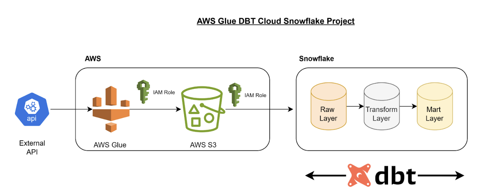

# Project Overview

1. In this project, we are utilizing AWS Glue to extract data from an external API and store it in JSON format within an S3 bucket. 

2. After the data has been loaded into the S3 bucket, we will employ dbt (Data Build Tool) to transfer the data from the S3 bucket into a staging table in Snowflake, using dbt macros for automation. 

3. Additionally, we are taking advantage of dbt's modeling capabilities to create the necessary tables in Snowflake across different layers: raw, transform, and mart.

By the end of the project, you will have practical experience in creating a scalable and automated data pipeline using AWS Glue, S3, dbt, and Snowflake, with a focus on ETL processes, data modeling, and cloud-based data storage.

 

# Project Steps

1. Create an AWS IAM Role for Glue Job Access:
The first step will be to set up an AWS Identity and Access Management (IAM) role specifically for the AWS Glue job. This role will grant the necessary permissions for the Glue job to read and write data to the designated S3 bucket.

2. Set Up an S3 Bucket for Data Storage:
Next, we will create an S3 bucket within our AWS account. This bucket will serve as the storage location for data extracted from an external API via AWS Glue. The S3 bucket will act as the intermediary where the API data is temporarily stored before being processed further.

3. Create an AWS Glue Job for Data Extraction and Writing:
Following this, we will create an AWS Glue job that will execute a Python script designed to pull data from the external API. This script will automate the extraction process, and the data will be written directly into the S3 bucket we previously created.

4. Set Up IAM Role and Storage Integration for Snowflake:
In the next step, we will create an AWS IAM role and a Storage Integration in Snowflake. This integration will establish a secure connection between the Snowflake environment and the AWS account, allowing Snowflake to read from the S3 bucket where the Glue job has stored the extracted data.

5. Create a DBT Cloud Account via Snowflake Partner Connect:
We will then create a DBT Cloud account through the Partner Connect feature within Snowflake. This integration allows us to leverage DBT’s capabilities for transforming and managing data models within the Snowflake environment.

6. Set Up DBT Models for Raw, Transform, and Mart Layers:
Next, we will configure the different layers of our data models using DBT. We will start by setting up the raw layer to store unprocessed data, followed by the transform layer for cleaning and transforming the data. The last step will be to create the mart layer, where the final, business-ready datasets will reside for consumption and analysis.

7. Set up a deployment environment in dbt

Lastly, we will configure a deployment environment in dbt to run our models and generate the corresponding schema and tables in the Snowflake production database.

